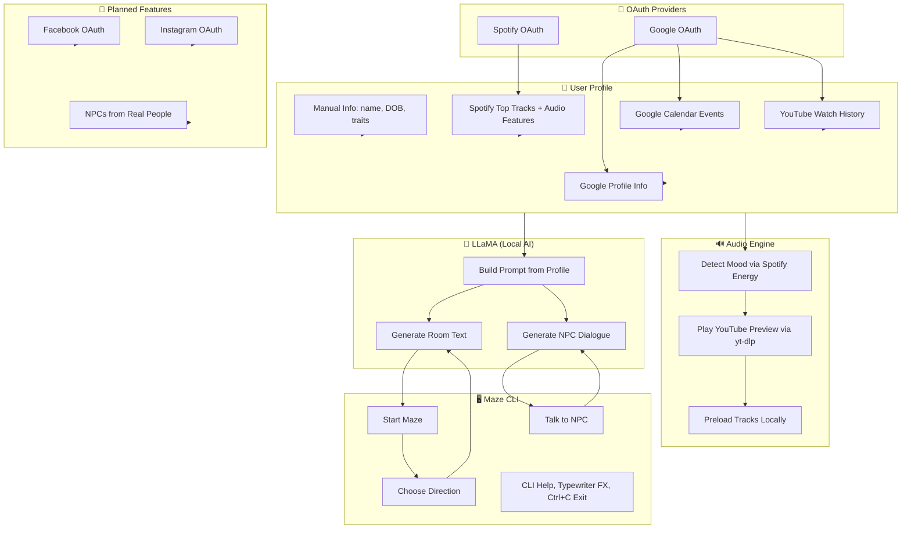

# 🎭 Maze of Me

> *A deeply personal, narrative-driven psychological game built entirely in Python, harnessing user data and AI-driven NPC interactions.*

## 📖 Overview

**Maze of Me** is a command-line psychological adventure game designed to immerse the player in a deeply personal narrative experience. The game dynamically adapts to the player's personal attributes and online presence, creating an emotionally resonant and profoundly unique gameplay journey. Players navigate through a dynamically generated text-based maze, interacting with emotionally charged rooms, AI-driven NPCs, and music curated specifically for them.

The game leverages OAuth logins (Spotify, Google, and eventually Facebook & Instagram) to gather user data and create a personalized, interactive experience.

---

## 🧩 Game Concept and Narrative Structure

Players awaken inside a mysterious maze, progressively uncovering memories, experiences, and subconscious thoughts. The game unfolds across three emotionally escalating acts:

- **Act 1: Awakening**  
  Rooms and interactions reflect neutral or positive emotions. Warm, upbeat music enhances the experience.

- **Act 2: Whispers**  
  Encounters become unsettling, referencing real-life events, relationships, and unresolved emotions from collected user data. NPCs become more confrontational, creating tension.

- **Act 3: Collapse & Reflection**  
  Reality breaks down, music distorts, and players face a profound psychological confrontation with their inner selves, culminating in self-reflection or a reset narrative loop.

---

## 🔑 Current Features & Implementation

### ✅ User Profile Collection
- **Manual Data Entry**: Full name, age, date of birth (EU format: DD-MM-YYYY), height (flexible parsing in meters or centimeters), weight, eye color, hair color, and skin color.
- **Robust Input Handling**: Continuous validation loops, clear error messages, and confirmation steps ensure accurate data collection.

### ✅ OAuth Integration (Spotify & Google)
- **Spotify Integration**: 
  - Authentication via OAuth with `spotipy`
  - Collection of user's top tracks, artists, and playlists
  - Analysis of audio features (valence, energy, tempo)
  - 30-second song previews identified for later retrieval (due to Spotify limitations, actual playback involves YouTube downloading)

- **Google Integration**:
  - OAuth authentication with `google-auth`
  - Fetching of user profile info (name, email, profile picture)
  - Import of Google Calendar events summaries
  - Optional import of YouTube watch history for deeply personalized interactions

### ✅ Audio Playback Integration
- **YouTube Preloading**:
  - Using `yt-dlp` to automatically download audio previews matching the user's Spotify top tracks
  - Dynamic playback through `pygame.mixer` and/or `pydub`

- **Emotion-Based Soundtracking**:
  - Music selections are context-sensitive, aligning song moods (determined by Spotify's energy/valence metrics) with room atmospheres.

### ✅ Dynamic Room & Maze Generation
- Room descriptions and layouts are dynamically generated using AI prompts tailored to user data and emotional contexts.
- Events tied to real-world context: Operating system date/time, calendar events, YouTube history, Spotify lyrics, etc.

### ✅ NPC Interactions (AI-Powered)
- **NPC Dialogue**:
  - Powered by locally-run LLaMA 3 models (`llama.cpp`, Ollama, LM Studio)
  - Dialogue personalized with names of real contacts, phrases from YouTube and Spotify data, and generated hallucinated memories

- **Interaction Mechanics**:
  - Simple dialogue choices to interact with NPCs:
    - `"What are you talking about?"`
    - `"Stay silent"`
    - `"You’re not real."`

### ✅ Enhanced User Experience
- Comprehensive CLI UX: robust parsing, clear help commands (`h`, `?`), graceful Ctrl+C exits, and terminal clearing for immersive sessions.
- Detailed logging via Python’s built-in `logging` module for debugging and future analytics.

---

## 🛠️ Tech Stack

- **Programming Language**: Python 3.13.3
- **CLI Engine**: Custom-built (`input()` and `print()` loops)
- **OAuth Libraries**: `spotipy`, `google-auth`, `requests-oauthlib`, `facebook-sdk` (planned future)
- **Audio Playback**: `pygame`, `pydub`, `simpleaudio`
- **Audio Preloading**: `yt-dlp` for downloading Spotify-linked YouTube audio
- **AI Integration**: Local LLM via `llama-cpp-python` (LLaMA 3), Ollama, LM Studio
- **Data Management**: JSON file storage (`user_profile.json`)
- **Utilities & Parsing**: Custom utilities for JSON I/O, input parsing, OS and datetime detection
- **Cross-Platform Compatibility**: Tested on Windows, Linux, macOS

---

## 🧠 System Architecture Diagram



---

## Alpha version (spotify auth + random music playlists on each room)


https://github.com/user-attachments/assets/a6890edb-5e31-453a-946f-791a08f5d106


---

## 🚀 Installation & Running Locally

### 1. Clone the repository:

```bash
git clone [https://github.com/bakill3/maze-of-me.git]
cd maze_of_me
```

### 2. Install dependencies:
```bash
pip install -r requirements.txt
```
### 3. Configure OAuth Credentials
Create a .env file in the root directory with:
```bash
SPOTIFY_CLIENT_ID=your_spotify_client_id
SPOTIFY_CLIENT_SECRET=your_spotify_secret
GOOGLE_CLIENT_ID=your_google_client_id
GOOGLE_CLIENT_SECRET=your_google_secret
```
### 4. Run the game:
```bash
python cli.py
```

## 🎯 Future Development & Roadmap

### 🚧 Short-term goals:
- **Full Spotify & Google integration**: Finalize OAuth workflows, data retrieval (Spotify playlists, top tracks, Google Calendar events, YouTube history), and seamless integration into gameplay.
- **Complete LLM integration**: Fully implement NPC dialogues, dynamic room descriptions, and emotional atmosphere generation with local LLaMA 3 models.

### 🛤️ Mid-term goals:
- **Facebook & Instagram OAuth Integration**: Add support for logging in via Facebook & Instagram to further enhance personalization.
  - Collect data such as likes, comments, and interactions from user's social media posts.
  - Generate NPCs that closely resemble user's real-life acquaintances and relationships based on collected data.

- **Enhanced NPC realism**: Utilize detailed social-media data to craft more emotionally engaging and realistic NPC interactions.

### 🌌 Long-term ambitions:
- **Advanced Psychological Analysis**: Integrate algorithms capable of deeper psychological profiling for more accurate personalization of narrative arcs and emotional experiences.
- **Optional Web-based UI**: Offer a web-based graphical interface as an optional extension of the CLI experience, enhancing immersion with visual and audio effects.

---

## 🧪 Testing

Comprehensive unit tests are provided for critical parsing functions, ensuring code robustness and reliability.

Run tests using `pytest`:

```bash
pytest tests/test_parsers.py
```

## ⚠️ Disclaimer & Privacy

**Maze of Me** places the highest priority on user privacy and data security:

- All user data collected via OAuth or manual input is stored **locally** and **never shared externally**.
- OAuth authentication tokens and sensitive data are securely handled and stored only for local use within gameplay.

---

## 🌟 Contribution & Feedback

Currently, the repository is private. However, feedback, suggestions, and collaboration opportunities are warmly welcomed. Please reach out directly to the repository owner to discuss potential improvements or future collaboration.

---

## ©️ License

The licensing model will be established prior to the project's public release. Currently, the repository remains private, and all rights are reserved by the author.

---

🎭 *Dive deeper into the labyrinth of your mind. Your journey within Maze of Me awaits.*

