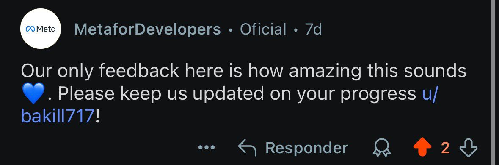
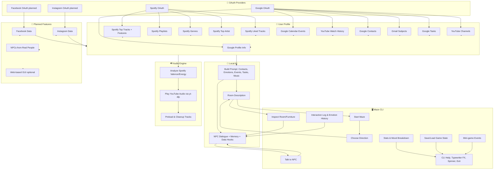

# 🎭 Maze of Me

> *A deeply personal, narrative-driven psychological game built entirely in Python, harnessing user data, emotion, and advanced AI-driven NPC interactions.*

---

## Game Video Showcase

[Watch the demo video](https://github.com/user-attachments/assets/d4413b68-8fca-4a8d-96b0-7f5cc9a4f602)

---

## 📖 Overview

**Maze of Me** is a command-line psychological adventure where your digital self is the foundation for a unique, emotional narrative. The game adapts to your profile, calendar, moods, and social connections, creating a different journey every session. Navigate a procedurally generated text maze, meet AI figures who remember your feelings and contacts, and discover how your online presence shapes your subconscious world.

OAuth logins (Spotify, Google, with Facebook & Instagram coming soon) bring in real data to create an interactive and personal experience.

---

## 🌟 Recognition & Community Feedback

Maze of Me has sparked strong community interest:

- 🏆 **Praised by Meta for Developers** on Reddit  
  > *"Our only feedback here is how amazing this sounds 💙 Please keep us updated on your progress u/bakill717!"*  

- 🌍 Featured across multiple Reddit communities, including **r/Python**, **r/MachineLearning**, **r/gamedev** reaching over **50,000+ views** in 7 days.

<table>
  <tr>
    <td></td>
    <td></td>
  </tr>
</table>

---

## 🧩 Game Concept and Structure

Players awake in a mysterious maze. The story and rooms reference your real-world data, events, moods, and contacts, integrating your digital and emotional life into an interactive psychological narrative:

- **Act 1: Awakening**  
  Bright rooms and supportive AI figures welcome you. Upbeat music, selected from your top Spotify tracks and YouTube history, enhances the mood.

- **Act 2: Whispers**  
  Rooms and AI figures reference real calendar events, friends, or memories. NPCs become more challenging, sometimes asking about people in your contacts or your recent mood.

- **Act 3: Collapse and Reflection**  
  The maze responds to your feedback, looping through memories and feelings until you reach deeper self-understanding or choose to start over.

---

## 🔑 Features

### ✅ Automated User Data Collection
- **Google OAuth**  
  - Fetches: profile info, calendar events, YouTube watch history, **contacts (names, emails, birthdays), Gmail subjects (last 5), Google Tasks (top 10), and recently watched YouTube channels.**
  - All data is merged into your game profile and used for richer room/NPC generation.
- **Spotify OAuth**  
  - Collects: your top tracks, audio features (valence, energy), **top artists, favorite genres, liked tracks, and playlists.** All data is mapped to in-game moods and events for music and narrative context.

### ✅ Emotion-Aware AI Gameplay
- **Procedural Maze & Room Generation**
  - Rooms are now generated using a much wider set of hooks: your calendar events, YouTube activity, contacts, Gmail, playlists, genres, and more.
  - **NPCs and room descriptions may reference your favorite artists, email subjects, playlists, and tasks.**
  - Room hooks and NPC context are more diverse, allowing each playthrough to be completely unique and personal.
- **Music as Mood**  
  - Each room's emotion is matched to your music using valence and energy from Spotify data.
  - Audio is preloaded using `yt-dlp` for instant playback and played with `pygame`.
  - Previous room's audio files are deleted automatically for optimal performance and minimal disk usage.
- **Advanced AI NPCs & Memory**
  - **NPCs now have “memory”**: they can recall your previous emotions, feedback, and even mention earlier NPC exchanges, moods, or player choices.
  - **Dialogue is now more deeply personalized**—NPCs may reference your recent moods (“I remember you were angry earlier…”), calendar events, contacts, or even subject lines from your recent emails.
  - **Dialogue choices and emotional feedback** influence subsequent AI responses, not just in the current room, but also across your whole session.
- **Inspect, Use, and Interact with Room Items**
  - You can now inspect or “use” furniture in each room for additional AI/NPC context, which may reference your personal data or prior actions.
  - Interactions are richer, sometimes involving a “mini-game” or riddle based on your current mood or room context.
- **Persistent Save/Load Sessions**
  - The game now supports saving and continuing your journey later, preserving your room history, moods, and all NPC memory.
  - Stats and mood breakdowns are available at any time to track your psychological journey.
- **Robust Data & Performance**
  - Previous room audio files are deleted on transition for disk and performance optimization.
  - All major Google and Spotify data fields are now loaded, cached, and referenced in both gameplay and AI logic.
- **AI Loading Spinner**
  - Whenever the AI NPC is generating a response, a live spinner keeps the interface responsive.

### ✅ Enhanced CLI User Experience
- Modern CLI with color, typewriter effect, clear menus, and easy navigation.
- Help menu, graceful exits, and robust error handling.
- Detailed logging of all interactions for transparency and debugging.

---

## 🛠️ Tech Stack

- **Programming Language**: Python 3.13.3
- **CLI Engine**: Custom-built (input, print, color, spinner, typewriter)
- **OAuth Libraries**: `spotipy`, `google-auth`, `requests-oauthlib`
- **Audio Playback**: `pygame`, `yt-dlp`
- **AI Integration**: Local LLM with `llama-cpp-python` (Phi-3, LLaMA, Mistral), Ollama, or LM Studio
- **Data Storage**: JSON files
- **Utilities**: Helpers for parsing, data, and OS/platform detection
- **Cross-Platform**: Runs on Windows, Linux, and macOS

---

## 🧠 System Architecture Diagram



---

## Version 0.1

https://github.com/user-attachments/assets/6feb4a40-a53a-40da-9f59-334e3a66992c

Current Version: 0.5
---

## 🚀 Installation & Running Locally

### 1. Clone the repository:

```bash
git clone https://github.com/bakill3/maze-of-me.git
cd maze_of_me

### 2. Install dependencies:
```bash
pip install -r requirements.txt
```
### 3. Configure OAuth Credentials
Create a .env file in the root directory with:
```bash
SPOTIFY_CLIENT_ID=your_spotify_client_id
SPOTIFY_CLIENT_SECRET=your_spotify_secret
GOOGLE_CLIENT_ID=your_google_client_id
GOOGLE_CLIENT_SECRET=your_google_secret
```

### 4. Download AI Model
To download the required language model, run download.bat inside the models folder before starting the game.

### 5. Run the game:
```bash
python cli.py
```

## 🗺️ Gameplay & AI Roadmap
- [x] Spotify and Google OAuth & Data Collection
- [x] YouTube Audio Preloading, Caching, and Cleanup
- [x] Emotion-driven Room and Music Generation
- [x] AI NPCs Powered by Local LLM, with Memory and Contacts
- [x] Dialogue Trees & Player Emotion Feedback
- [x] Loading Spinner for AI Responses
- [x] Inspect & Use Room Items
- [x] Per-Room Audio Cleanup for Performance
- [x] NPCs Reference Contacts, Real Events, and Player Emotions
- [x] Save & load full session, stats, and persistent NPC memory
- [x] Gmail, Google Tasks, and YouTube channel data included in room/NPC logic
- [x] Mini-games and dynamic item interactions
- [ ] Facebook & Instagram Integration (planned)
- [ ] Persistent Cross-Session NPC Memory (planned)
- [ ] Optional Web-based GUI (planned)

---

## 🧪 Testing

Unit tests for all critical parsing and CLI logic.  
To run tests:
```bash
pytest tests/test_parsers.py
```

## ⚠️ Disclaimer & Privacy

**Maze of Me** places the highest priority on user privacy and data security:

- All user data collected via OAuth or manual input is stored **locally** and **never shared externally**.
- OAuth authentication tokens and sensitive data are securely handled and stored only for local use within gameplay.

---

## 🌟 Contribution & Feedback

Maze of Me is open to your ideas!
Open an issue, fork the repo, or contact the maintainer to contribute.
---

## License

This project is licensed under a **Proprietary License**.  
All rights reserved © 2025 Gabriel Deodato Leite Brandão.

This protection extends beyond the current codebase to encompass the entire concept and planned innovations—including emotion-driven room and music systems, data integrations (Spotify, Google, YouTube, Gmail, Tasks, Contacts), memory-enabled AI NPCs, personalized narrative mechanics, and envisioned extensions such as NPCs modeled on real people, multiplayer, 2D/3D/VR/AR versions, Web UI, plus both local and cloud-based AI processing.

For full terms, refer to the [LICENSE](./LICENSE) file.

---

🎭 *Dive deeper into the labyrinth of your mind. Your journey within Maze of Me awaits.*

